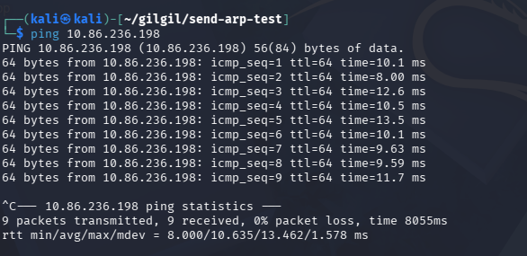

# arp-spoof

## 과제

ARP spoofing 프로그램을 구현하라.

## 실행

```text
syntax : arp-spoof <interface> <sender ip 1> <target ip 1> [<sender ip 2> <target ip 2>...]
sample : arp-spoof wlan0 192.168.10.2 192.168.10.1 192.168.10.1 192.168.10.2
```

## 실행 결과

#### Attacker

[arp-spoof-attacker.mp4](./arp-spoof-attacker.mp4)

#### Victim


